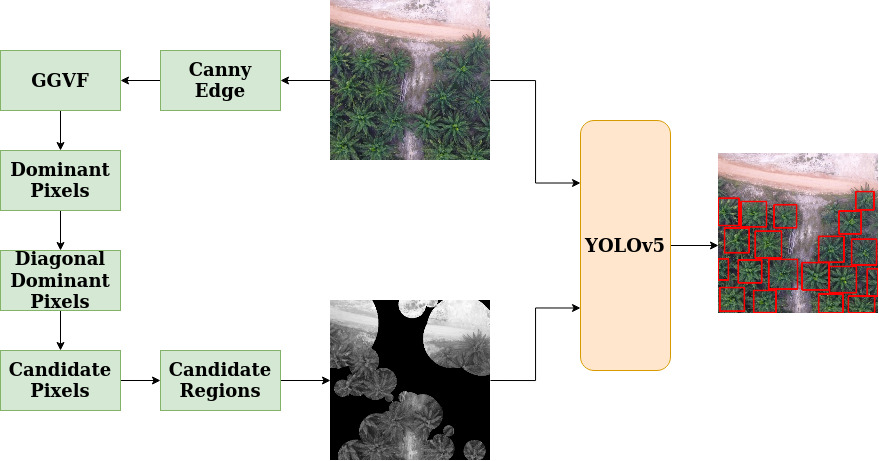
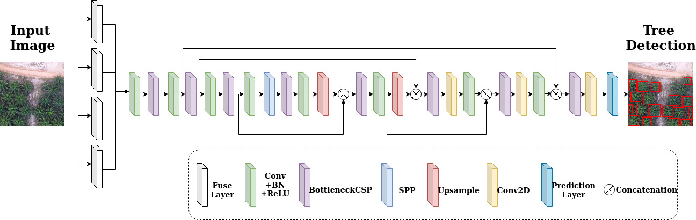

# Oil Palm Tree Counting in Drone Images

*Anonymous Authors*

## Abstract

When the images are captured by drones in oblique angles, palm tree
detection is challenging. This paper presents a method towards palm tree counting
using a novel idea of detecting dominant points by exploring Generalized Gradient
Vector Flow, which defines symmetry based on gradient direction of the pixels.
For each dominant point, we use angle information for classifying diagonal
dominant points. The proposed method expands the direction of diagonal
dominant points until it finds intersection point with another diagonal dominant
point. The step works based on the fact that the direction of the branches of tree
meet at center of tree. This step results in candidate points. For each candidate
points, the proposed method constructs the ring by considering the distance
between intersection and nearest neighbor candidate point as radius. This outputs
region of interest, which includes center of each tree in the image. To remove false
positives, we explore deep learning YOLOv5 architecture that counts oil palm tree
in the drone images irrespective of tree type of palm family. Experimental results
on our dataset of the images captured by drones and standard dataset of coconut
images captured by UAV (Unmanned Aerial Vehicle) of different trees show that
the proposed method is effective and better than SOTA methods.

### Block Diagram of this new method



### Network architecture of off-the-shelf YOLOv5



### Installation Instruction

- ```git clone https://github.com/pinakinathc/oil-palm-detection.git```

- ``````conda env create -f environment.yml```

- Go to ```ggvf_gvf``` directory using ```cd ggvf_gvf/```

- Keep your input images inside ```sample_images/``` directory and run ```matlab -batch pinaki```. This will generate the *ggvf* results in ```ggvf_output/``` directory.

- Go to the ```ggvf_output/``` directory and rename all ```*.mat``` files to ```*.jpg``` using the command: ```rename 's/.mat/.jpg/' *.mat```

- Go to root directory and evaluate the candidate regions using: ```python main.py enter/path/to/dir/with/RGB/input/images enter/path/to/dir/with/ggvf/images --vis_save_path path/to/save/candidate/images```

- Use these results from ```main.py``` as input to **yolov5** following the instruction in ```README.md``` file present in ```yolov5``` dir.

### Reference

Big thanks to [ultralytics](https://github.com/ultralytics/yolov5) for sharing their code

### Future Tasks

- Clean code

- Add authors names

- Upload trained model weights
